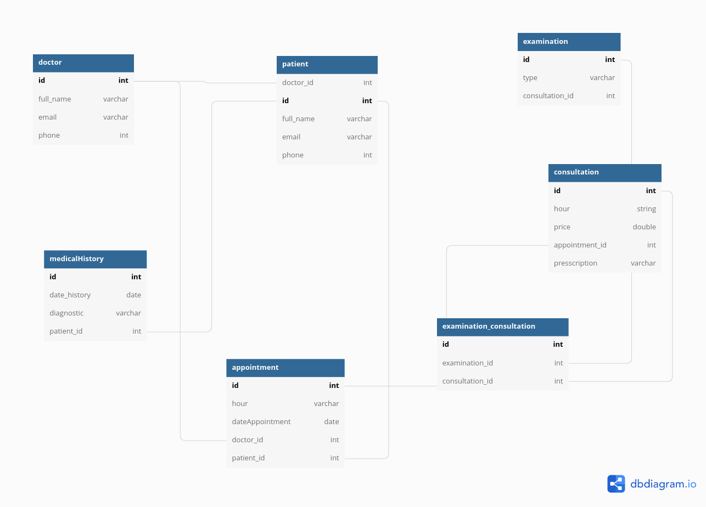

<!-- Headings -->

# Medical Appointment App :green_book:

This project is a REST API implementation which allows you to schedule appointments with a doctor. This is developed in node with diferent libraries and framework:<br/>
:ballot_box_with_check: express <br/>
:ballot_box_with_check: dotenv(enviroment variables)<br/>
:ballot_box_with_check: sequelize(ORM - Postgresql)<br/>
:ballot_box_with_check: docker :whale:<br/>
:ballot_box_with_check: JWT<br/>
:ballot_box_with_check: Passport.js<br/>
:ballot_box_with_check: Joi<br/>
:ballot_box_with_check: Hapi Boom<br/>

## Getting Started

### Prerequisites

Software which you need to have installed

```
git node
```

First, we must understand the entity-relationship diagram

Open terminal and create directory where you will clone this respository<br/>

```
mrkdir example-name
```

To run this application in dev mode type the following command

```
npm run dev
```
